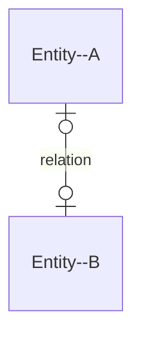
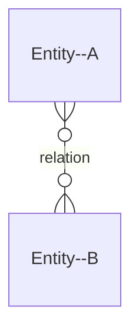

# ER Diagrams

Source-code is available at [GitHub](https://github.com/nicojmn/LINFO2172-cheatsheet). Feel free to contribute !

## Relationships multiplicity

Note : mermaid uses ER Crow's Foot notation, it's recommended to know all representations for the exam.

### 1:1 multiplicity, not mandatory

### M:N multiplicity, not mandatory

