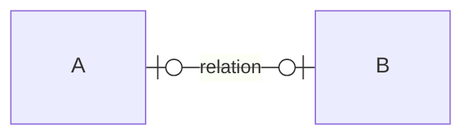
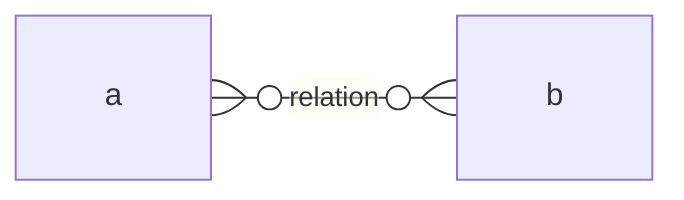
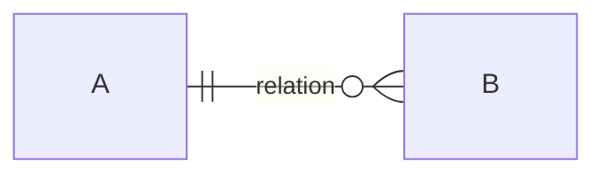
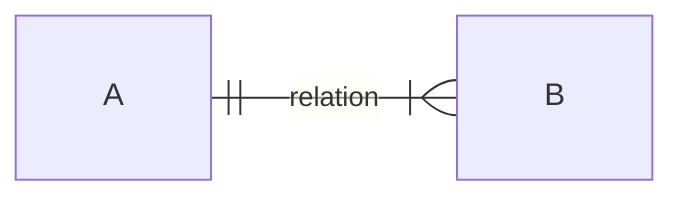
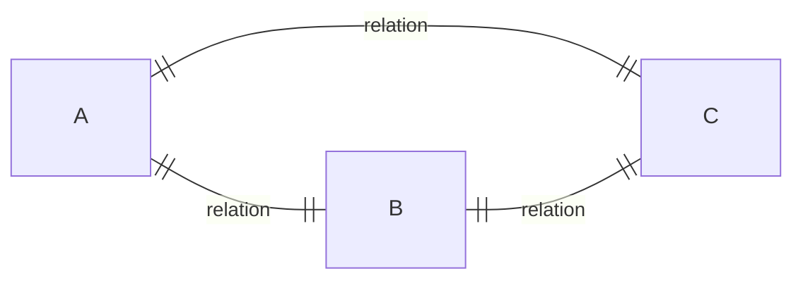
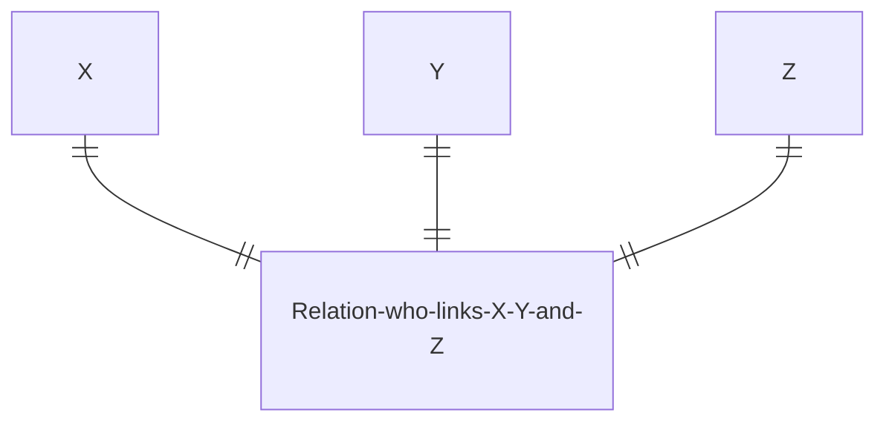
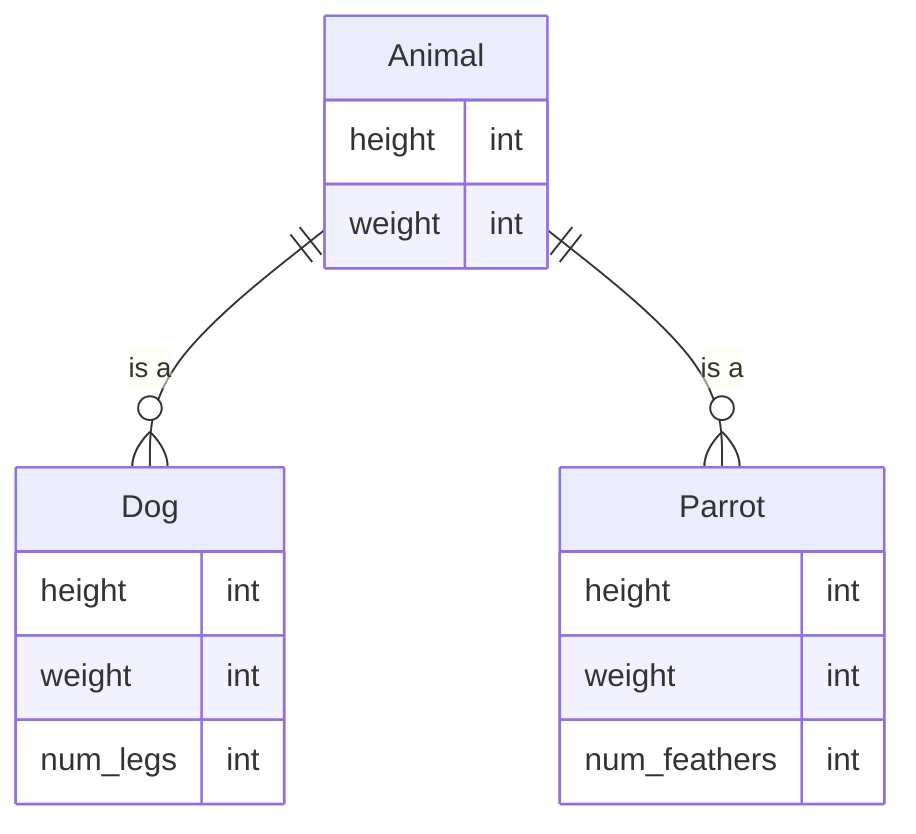
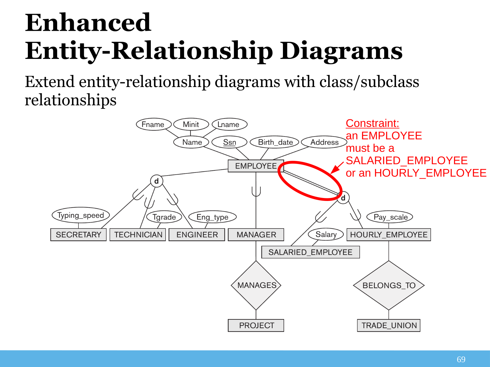
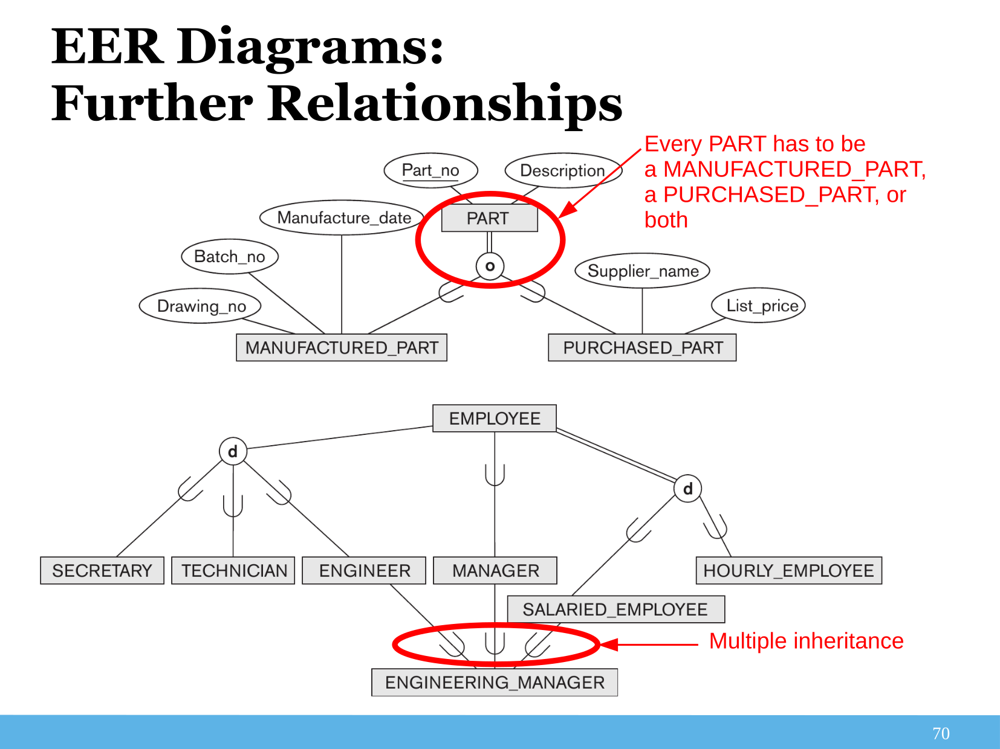

# ER Diagrams

Source-code is available at [GitHub](https://github.com/nicojmn/LINFO2172-cheatsheet). Feel free to contribute !

## Conceptual design

Visualization of information we conceptually plan to store, how we link tables isn't done here, just the entities and their attributes.

## Physical design

Every attributes in relational database is listed, how we link tables is done here.

## Relationships multiplicity

Note : mermaid uses ER Crow's Foot notation, it's recommended to know all representations for the exam.

### 1:1 multiplicity, not mandatory

### M:N multiplicity, not mandatory

### 1:N multiplicity, not mandatory

### 1:N multiplicity, mandatory (left hand side)

### 1:N multiplicity, mandatory (both sides)

### Ternary relationship

In ER Chen's / ORM : additional diamond / boxes are used to represent ternary relationships, but in Crow's Foot and UML, add boxes and lines to represent the relationship.

### Constraining relationships

- $\forall \text{(A, B) combination} \Rightarrow \text{only one C}$

- For a $nth$ degree relationship, any constrait must cover $\geq n - 1$ entities, otherwise we can split relationships into smaller ones.

### Misc

- Entities can be related to themselves
- Don't forget to add primary keys (PK) and foreign keys (FK).
- Composite keys : keys made of multiple attributes
- Multi-valued attributes : attributes that represent a set of values.
  
## Weak entities

Entities whose existence depends on another entity

- Cascade delete : if the parent entity is deleted, the weak entity is also deleted.
- Weak entities are represented with a double rectangle in ER Chen, aggregation in UML, no specific representation in Crow's Foot / ORM.

## Conceptual design $\rightarrow$ Physical design

1. Convert entities and their single-valued attributes
2. Convert weaker entities and their single-valued attributes. Then add foreign key attributes for the owner entity.
3. Convert M:N relationships, with additional relation with foreign keys for connected entities.
4. Convert 1:1 relationships:
   - With same method as M:N relationships or
   - Add key of one related entity as foreign key in the other entity.
   - Merge both entities into one, if applicable
5. Convert 1:N relationships with same options than 1:1 relationships
6. Convert multi-valued attributes

## Enhanced ER Diagrams

Extend ER diagrams with class and subclass relationships

### Inheritance

- Subclass : entity that inherits from another entity, can have additional attributes.
- Superclass : entity that is inherited from, with common attributes.
- Multiple inheritance is allowed

### Specialization and generalization

### Converting EER to relational schemes

Choose one of the following methods:

- Create a relation for every entity, using FK to refer subclasses to superclass
- put every entities in one relation, adding attributes to identify the subclass to which a tuple belongs to
- Create a relation for every entity in a total inheritance, but not for superclass
