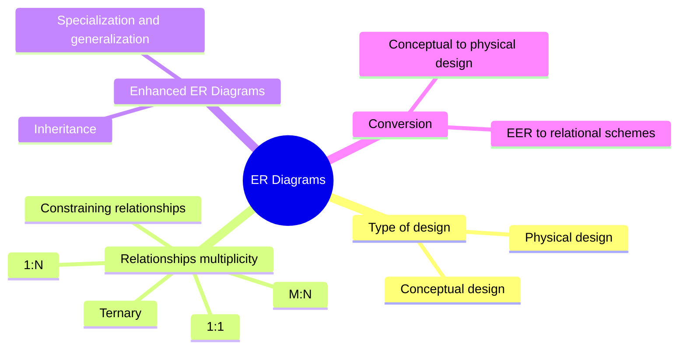
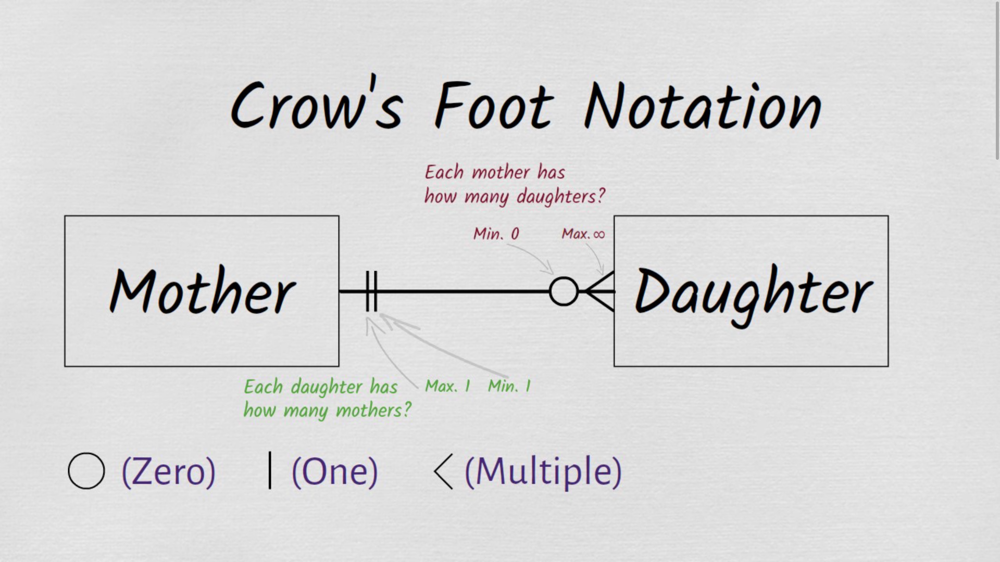
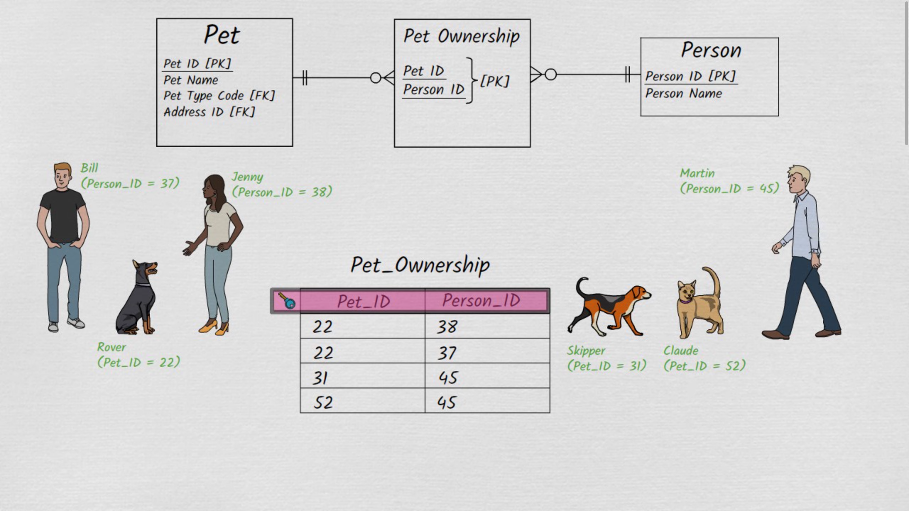
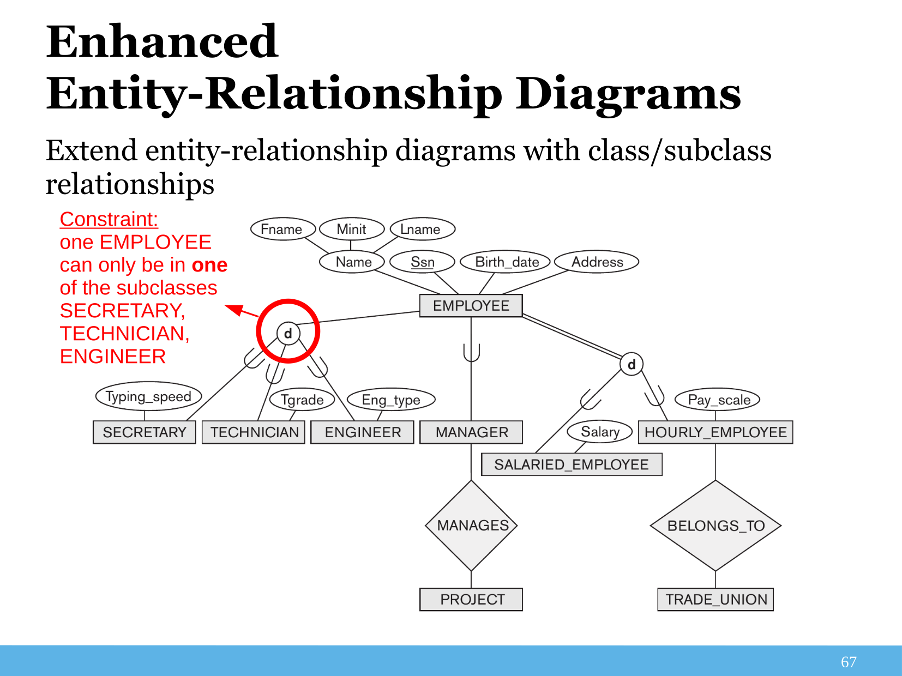
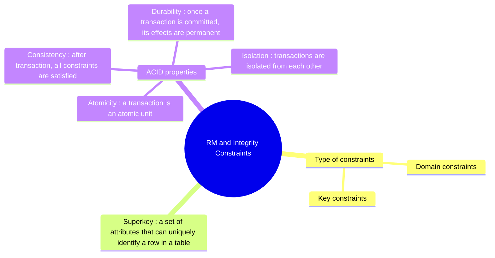

# LINFO2172 Cheatsheet

Cheatsheet for the LINFO2172 course at UCLouvain, covering the main concepts of the course. This isn't a complete summary
and you should of course read the slides and refer to the course material for a complete understanding.

Source-code is available at [GitHub](https://github.com/nicojmn/LINFO2172-cheatsheet). Feel free to contribute !

# ER Diagrams

## Mindmap

## Conceptual design

Visualization of information we conceptually plan to store, how we link tables isn't done here, just the entities and their attributes.

## Physical design

Every attributes in relational database is listed, how we link tables is done here.

## Relationships multiplicity

Note : mermaid uses ER Crow's Foot notation, it's recommended to know all representations for the exam.

### 1:1 multiplicity, not mandatory

### M:N multiplicity, not mandatory

### 1:N multiplicity, not mandatory

### 1:N multiplicity, mandatory (left hand side)

### 1:N multiplicity, mandatory (both sides)

### Ternary relationship

In ER Chen's / ORM : additional diamond / boxes are used to represent ternary relationships, but in Crow's Foot and UML, add boxes and lines to represent the relationship.

### Constraining relationships

- $\forall \text{(A, B) combination} \Rightarrow \text{only one C}$

- For a $nth$ degree relationship, any constrait must cover $\geq n - 1$ entities, otherwise we can split relationships into smaller ones.

### Misc

- Entities can be related to themselves
- Don't forget to add primary keys (PK) and foreign keys (FK).
- Composite keys : keys made of multiple attributes
- Multi-valued attributes : attributes that represent a set of values.

- When having a many to many relationship you cannot directly represent it in a database so you create a middle table

  
## Weak entities

Entities whose existence depends on another entity

- Cascade delete : if the parent entity is deleted, the weak entity is also deleted.
- Weak entities are represented with a double rectangle in ER Chen, aggregation in UML, no specific representation in Crow's Foot / ORM.

## Conceptual design $\rightarrow$ Physical design

1. Convert entities and their single-valued attributes
2. Convert weaker entities and their single-valued attributes. Then add foreign key attributes for the owner entity.
3. Convert M:N relationships, with additional relation with foreign keys for connected entities.
4. Convert 1:1 relationships:
   - With same method as M:N relationships or
   - Add key of one related entity as foreign key in the other entity.
   - Merge both entities into one, if applicable
5. Convert 1:N relationships with same options than 1:1 relationships
6. Convert multi-valued attributes

## Enhanced ER Diagrams

Extend ER diagrams with class and subclass relationships

### Inheritance

- Subclass : entity that inherits from another entity, can have additional attributes.
- Superclass : entity that is inherited from, with common attributes.
- Multiple inheritance is allowed

### Specialization and generalization

### Converting EER to relational schemes

Choose one of the following methods:

- Create a relation for every entity, using FK to refer subclasses to superclass
- put every entities in one relation, adding attributes to identify the subclass to which a tuple belongs to
- Create a relation for every entity in a total inheritance, but not for superclass

# Relational Model and Integrity Constraints

## Mindmap

## Domain constrains

Set of values that an attribute can take for every attributes

- SQL has built-in types (int, varchar, date, etc.)
- Range restrictions can be added with CHECK constraints

## Key constraints

Identify a row uniquely in a table

### Superkey

$$\text{Given a relation over schema } R(A_1, ..., A_n), \text{ a set of attributes } \mathcal{K} \subseteq \{A_1, ... , A_n\} \newline
\text{ is a superkey for } R \iff \forall \text{ pair of different tuples } t_1 \text{ and } t_2 \in R \text{ it holds that }
\exists A \in \mathcal{K} : t_1 . A \neq t_2 . A$$

- A key is a minimal superkey
- If a relation has multiple keys, all keys are called candidate keys
- Primary key (PK) is a chosen candidate key

### FK constraint

When a relation A refers to the PK of another relation B, A never contains values that are not present in B

### Constraint violation

Default behavior is to reject the operation

## Transactions and ACID properties

A transaction is a sequence of operations that are executed in a ACID way

### ACID

- **Atomicity** : a transaction is an atomic unit, either all operations are executed or none.
- **Consistency** : after transaction, all integrity constraints are satisfied.
- **Isolation** : transactions are isolated from each other, concurrent transactions do not interfere with each other.
- **Durability** : once a transaction is committed, its effects are permanent, even in case of (power) failure.
